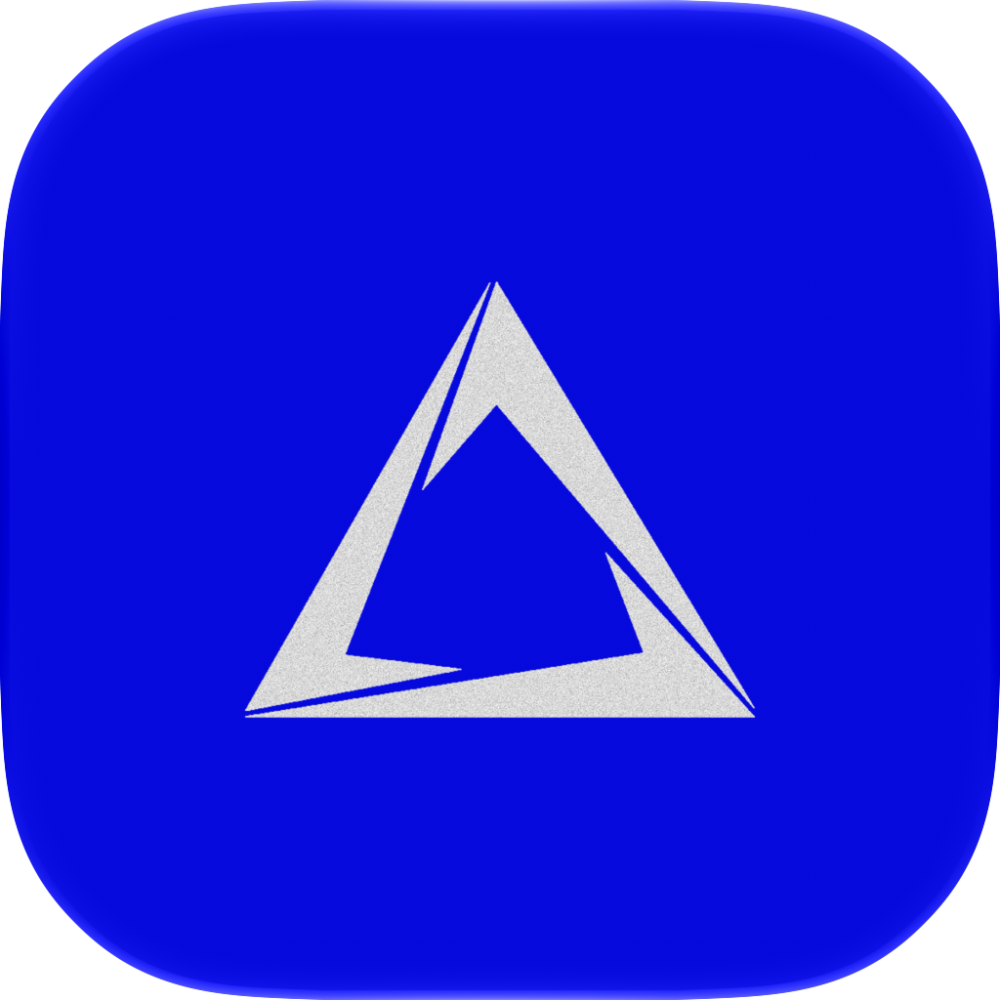

<div align="center">



# Axe Code

**One window for all your coding agents.** Drive Claude Code, Codex, Cursor, Grok, Hermes, Pi, Antigravity and more — local-first, native, fast.

[](https://axeai.com/code)
[](https://axeai.com/code)
[](https://axeai.com/code)

[axeai.com](https://axeai.com) · [Product page](https://axeai.com/code) · [X @AxeAI_com](https://x.com/AxeAI_com)

</div>

---

Axe Code is a native desktop workspace for running many coding-agent sessions at once. It is not another agent — it drives the harnesses you already use, in a fast Rust + gpui app instead of a dozen terminals.

- **Every harness, one UI** — Claude Code, Codex, Cursor, Grok, Hermes, Pi, OpenCode, Antigravity. Sessions are first-class objects you can search, resume, and steer — not terminal tabs.
- **Local-first** — no account required. Sessions, history, and workspaces live on your machine in `~/.axecode`.
- **Git-aware workspaces** — live diffs and commit history per session, with worktrees under `axecode/` so parallel agents never collide on the same checkout.
- **Headless mode** — `axecode` runs as a daemon on a server or VPS; attach the desktop app to it and your agents keep working after you close the laptop.
- **Built-in MCP server** — agents can control the app itself (`axecode:*` tools) for orchestration workflows.

## Download

Grab the latest release from **[axeai.com/code](https://axeai.com/code)** — the page auto-detects your platform:

| Platform | Asset |
|---|---|
| macOS (Apple Silicon) | `AxeCode-<version>-macos-arm64.dmg` |
| macOS (Intel) | `AxeCode-<version>-macos-x86_64.dmg` |
| Windows | `AxeCode-<version>-windows-x86_64-setup.exe` |
| Linux | `AxeCode-<version>-linux-x86_64.tar.gz`, then run `install.sh` |

No account or network connection is needed — everything stays on your device.

## Headless CLI

For servers without a display — a VPS that keeps agents running after you close your laptop:

```bash
axecode daemon start   # run the engine as a background service
axecode status         # engine status and mode
axecode update         # update to the latest release
axecode daemon stop
```

## Multi-device sync

Multi-device sync is coming to Axe Code — sign in once and follow or drive agents across your machines. Until the Axe Code edge ships, the app runs fully local.

## Development

```bash
cargo build                    # build the CLI + app
scripts/run-macos-dev.sh       # build + launch an isolated dev bundle (macOS)
```

The dev bundle uses its own bundle id (`com.axeai.axecode.dev`), data dir, and IPC port, so it can run side-by-side with an installed copy.

Repo layout: `apps/zeron` is the desktop app binary (`axecode`), `crates/` holds the engine, UI, sync, harness adapters, and supporting libraries, `edge/` is the (not yet deployed) sync backend, `dist/` holds packaging assets including the Icon Composer source at `dist/macos/AxeAI.icon`.

## Acknowledgements

Axe Code is a fork of [Zeron](https://github.com/zeronsh/zeron) by Wing — the engine, UI architecture, and protocol design are his work, released under MIT. We keep internal crate names (`zeron-*`) unchanged to stay mergeable with upstream.

## License

[MIT](LICENSE) — Copyright (c) 2026 Axe AI (fork modifications) and the original Zeron authors.
